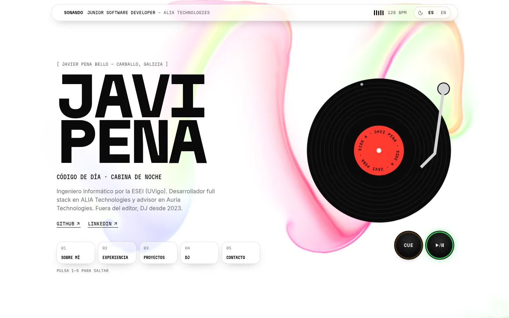
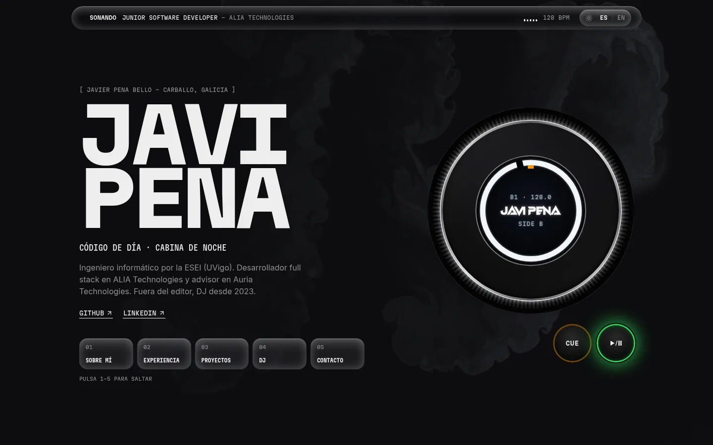
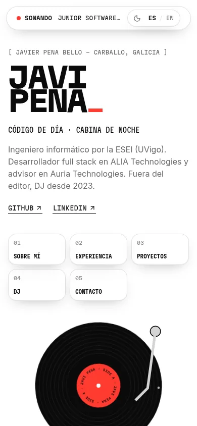
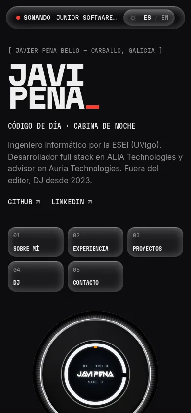
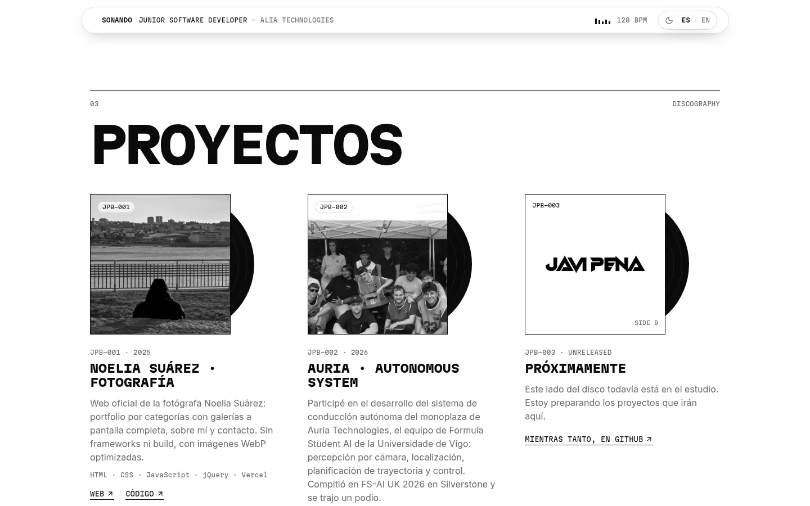

# Javi Pena · Portfolio

Personal portfolio of **Javi Pena**, computer engineer and full stack developer (and DJ after hours).
The whole site is built around a record: light mode is **side A** with a vinyl on a turntable, dark mode is **side B** with a CDJ-3000 style jog wheel.

**Live:** [javipena.vercel.app](https://javipena.vercel.app) · Spanish at `/`, English at `/en/`




<p>
  
  
</p>

## Features

- **Fluid background** in WebGL that follows the cursor: rainbow dye in light mode, turbulent club smoke in dark mode.
- **Playable deck** in the hero: PLAY/PAUSE with a vinyl brake, CUE that behaves like a CDJ (set, jump back, hold to preview) and **scratch** by dragging the record or the jog with mouse or touch.
- **Side A / side B themes**: the deck flips over from the vinyl to the CDJ when switching between light and dark, and the choice is remembered.
- **Liquid glass** UI (frosted, refracting surfaces) on the header, section pads and labels.
- **Bilingual** (ES / EN) with Astro i18n routing.
- Content as data: experience as a vinyl tracklist, projects as a discography, DJ venues, certifications and skills all come from typed files in `src/data/`.
- **Accessible**: skip link, visible focus ring, keyboard shortcuts (`1`-`5` jump to sections), everything respects `prefers-reduced-motion`.
- **Fast**: no UI framework at runtime, about 8 KB of JavaScript in total (gzip), inlined CSS, optimized WebP images. Lighthouse 100 on desktop in all four categories and 95+ performance on mobile.
- SEO ready: sitemap, `robots.txt`, canonical and `hreflang` links, Open Graph images per language and `Person` structured data.



## Tech stack

- [Astro 7](https://astro.build) (static output) with TypeScript
- [Tailwind CSS 4](https://tailwindcss.com)
- WebGL fluid simulation (vanilla TypeScript)
- [Lucide](https://lucide.dev) icons, Inter and Martian Mono via Fontsource
- `@astrojs/sitemap`, `sharp` for image optimization
- Deployed on [Vercel](https://vercel.com) with Vercel Web Analytics (cookieless)

## Getting started

Requirements: **Node 22.12+** and **pnpm 10** (pinned through `packageManager`; `corepack enable pnpm` sets it up).

```bash
pnpm install
pnpm dev        # http://localhost:4321
pnpm build      # static site in dist/
pnpm preview    # serve the build locally
```

`pnpm-workspace.yaml` hardens installs: only allow-listed packages may run install scripts, and versions published less than 7 days ago are skipped.

## Project structure

```text
src/
├── assets/         # DJ logo and project covers (optimized at build time)
├── components/     # Hero, Deck (vinyl / CDJ), sections, Knob, ScrollReveal, ...
├── data/           # profile, about, experience, projects, dj: the site content
├── i18n/           # UI strings in Spanish and English + helpers
├── layouts/        # Layout with head/SEO, theme bootstrap and the fluid background
├── pages/          # index, en/index, 404 and robots.txt
├── scripts/        # fluid.ts, the WebGL simulation
├── styles/         # global.css: theme tokens, liquid glass, hardware styles
└── views/          # Home view shared by both languages
public/             # favicons and Open Graph images
```

## Editing content

Most updates only touch a data file, no component changes needed:

Jobs, certifications and skills are synced from LinkedIn. Export your data from LinkedIn
(*Settings → Data privacy → Get a copy of your data*) and run:

```bash
pnpm sync:linkedin ~/Downloads/Complete_LinkedInDataExport_XX.zip
```

It only reads `Positions.csv`, `Certifications.csv` and `Skills.csv`, updates `src/data/linkedin.json`
and lists anything new that still needs a place in `src/data/linkedin-editorial.ts`
(order, translations, skill groups, technologies per company).

| To change | Edit |
| --- | --- |
| Roles, dates, certifications, skills | LinkedIn, then `pnpm sync:linkedin` |
| How they are shown (order, names, groups, stack per company) | `src/data/linkedin-editorial.ts` |
| Projects (cover image goes in `src/assets/projects/`) | `src/data/projects.ts` |
| Education | `src/data/about.ts` |
| DJ genres, gear, venues and show photos | `src/data/dj.ts` |
| Name, location and social links | `src/data/profile.ts` |
| Any interface text, in both languages | `src/i18n/ui.ts` |

## Credits

- The fluid background is based on [React Bits' Splash Cursor](https://reactbits.dev/animations/splash-cursor), itself built on [Pavel Dobryakov's WebGL Fluid Simulation](https://github.com/PavelDoGreat/WebGL-Fluid-Simulation).
- Hardware references: Pioneer DJ CDJ-3000 and XDJ-RX3.

## License

The code is open for reference. The personal content (texts, photos, logos and project covers) belongs to its owners and may not be reused.
